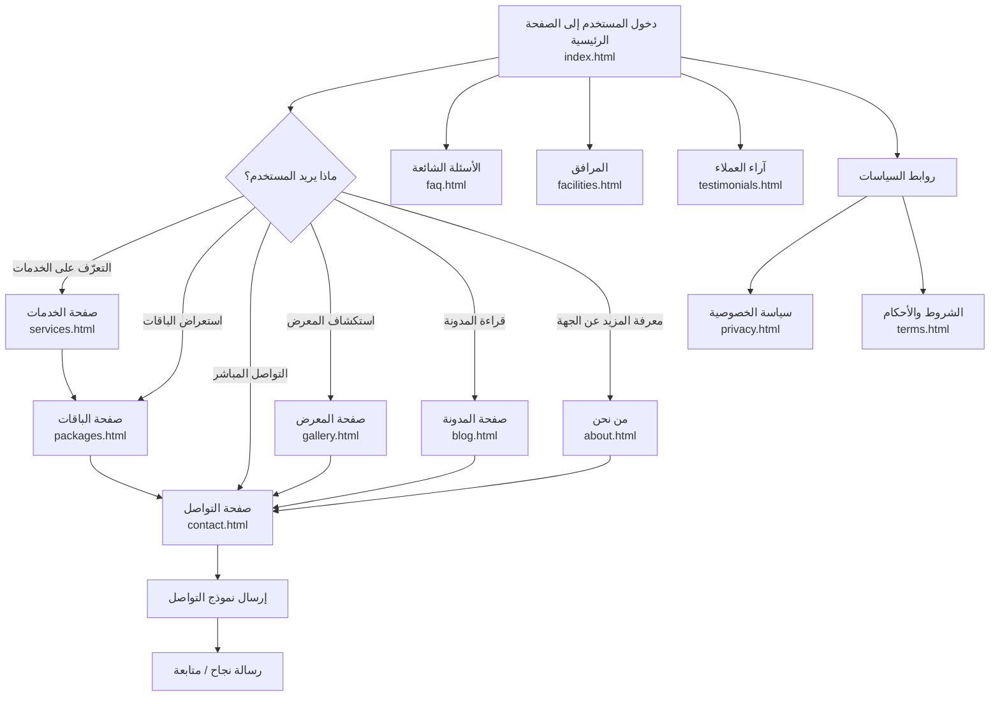
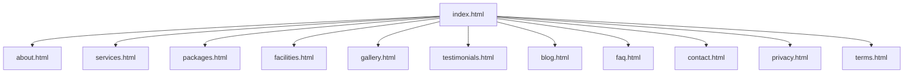

# مخطط الموقع الإلكتروني (Flowchart + Wireframes + Sitemap)

هذا المستند يقدّم تصورًا متكاملًا لبنية الموقع الحالي وتجربة المستخدم:

- **مخطط انسيابي** لمسار المستخدم.
- **تصميمات أولية (Wireframes)** لصفحات أساسية.
- **خريطة موقع (Sitemap)** تعتمد على الصفحات الموجودة فعليًا.

---

## 1) المخطط الانسيابي (User Flow)



---

## 2) التصميمات الأولية (Wireframes)

> ملاحظة: هذه تصميمات هيكلية منخفضة الدقة لتوضيح توزيع العناصر، وليست تصميمًا بصريًا نهائيًا.

### 2.1 الصفحة الرئيسية (Home)

```text
+--------------------------------------------------+
| الشعار | الرئيسية | الخدمات | الباقات | تواصل       |
+--------------------------------------------------+
|                Hero Section                      |
|      عنوان قوي + وصف مختصر + زر CTA             |
|            [احجز الآن]  [اعرف المزيد]           |
+--------------------------------------------------+
|             أقسام سريعة (Cards)                 |
| [خدمات] [باقات] [معرض] [آراء العملاء]           |
+--------------------------------------------------+
|              نبذة قصيرة + إحصائيات              |
+--------------------------------------------------+
|          دعوة للتواصل / نموذج مختصر             |
+--------------------------------------------------+
| Footer: روابط الصفحات + الخصوصية + الشروط      |
+--------------------------------------------------+
```

### 2.2 صفحة الخدمات (Services)

```text
+--------------------------------------------------+
| Header/Nav                                       |
+--------------------------------------------------+
| عنوان الصفحة + مقدمة قصيرة                       |
+--------------------------------------------------+
| [خدمة 1]  [خدمة 2]  [خدمة 3]                     |
| تفاصيل مختصرة + أيقونة + زر "اطلب الخدمة"      |
+--------------------------------------------------+
| قسم أسئلة شائعة متعلق بالخدمات                   |
+--------------------------------------------------+
| CTA نهائي: تواصل معنا                            |
+--------------------------------------------------+
| Footer                                            |
+--------------------------------------------------+
```

### 2.3 صفحة الباقات (Packages)

```text
+--------------------------------------------------+
| Header/Nav                                       |
+--------------------------------------------------+
| عنوان: الباقات والأسعار                           |
+--------------------------------------------------+
| [باقة أساسية] [باقة متقدمة] [باقة مميزة]        |
| السعر - المزايا - زر اختيار                       |
+--------------------------------------------------+
| جدول مقارنة بين الباقات                           |
+--------------------------------------------------+
| CTA: احجز الآن / تواصل للاستفسار                 |
+--------------------------------------------------+
| Footer                                            |
+--------------------------------------------------+
```

### 2.4 صفحة التواصل (Contact)

```text
+--------------------------------------------------+
| Header/Nav                                       |
+--------------------------------------------------+
| عنوان + وسائل التواصل (هاتف / بريد / موقع)       |
+--------------------------------------------------+
| نموذج تواصل                                      |
| الاسم | البريد | الموضوع | الرسالة               |
|                [إرسال]                           |
+--------------------------------------------------+
| خريطة الموقع / موقع الفرع (اختياري)              |
+--------------------------------------------------+
| Footer                                            |
+--------------------------------------------------+
```

---

## 3) خريطة الموقع (Sitemap)



---

## 4) توصيات تصميم سريعة

1. **توحيد CTA أساسي** عبر الصفحات (مثال: "احجز الآن").
2. **إبراز الباقات** بوضوح بصري (بطاقة مميزة للباقة الأكثر طلبًا).
3. **تقليل خطوات التواصل** عبر نموذج بسيط وواضح.
4. **تحسين التنقل** بإضافة روابط سريعة لأهم الصفحات في الهيدر والفوتر.
5. **دعم RTL كامل** في الهوامش والمحاذاة والخطوط لضمان تجربة عربية ممتازة.

---

## 5) الكود الزائف للموقع وأجزائه (Pseudo-code بالعربي)

> الهدف: وصف منطق عمل الموقع بطريقة مفهومة قبل البرمجة الفعلية.

### 5.1 تهيئة الموقع العامة

```text
إبدأ
    حمّل الإعدادات العامة للموقع (اسم الموقع، اللغة = العربية، اتجاه = RTL)
    حمّل عناصر الواجهة المشتركة (الهيدر، القائمة، الفوتر)
    حدّد الصفحة الحالية من الرابط
    اعرض محتوى الصفحة الحالية
إنهاء
```

### 5.2 منطق التنقل بين الصفحات

```text
دالة انتقل_إلى_صفحة(اسم_الصفحة):
    إذا كانت الصفحة موجودة في خريطة_الموقع
        افتح الرابط المرتبط بها
    وإلا
        افتح صفحة "غير موجود" أو أعد المستخدم للرئيسية
نهاية
```

### 5.3 الصفحة الرئيسية (index)

```text
عند تحميل الصفحة_الرئيسية:
    اعرض قسم البطل (Hero)
    اعرض الأزرار الأساسية:
        زر "احجز الآن" -> انتقل_إلى_صفحة("التواصل")
        زر "اعرف المزيد" -> انتقل_إلى_صفحة("الخدمات")
    اعرض بطاقات سريعة (الخدمات، الباقات، المعرض، آراء العملاء)
    اعرض نبذة مختصرة وإحصائيات
    اعرض دعوة نهائية لاتخاذ إجراء
نهاية
```

### 5.4 صفحة الخدمات (services)

```text
عند تحميل صفحة_الخدمات:
    جلب قائمة_الخدمات من مصدر البيانات
    لكل خدمة في قائمة_الخدمات:
        اعرض اسم الخدمة
        اعرض وصف مختصر
        اعرض زر "اطلب الخدمة"
            عند الضغط -> انتقل_إلى_صفحة("التواصل") مع تمرير اسم_الخدمة
    اعرض قسم أسئلة شائعة خاص بالخدمات
نهاية
```

### 5.5 صفحة الباقات (packages)

```text
عند تحميل صفحة_الباقات:
    جلب قائمة_الباقات
    اعرض الباقات على شكل بطاقات مقارنة
    إذا كانت هناك باقة_موصى_بها
        أضف شارة "الأكثر طلبًا"
    عند ضغط المستخدم على "اختيار الباقة":
        خزّن اسم_الباقة_المختارة مؤقتًا
        انتقل_إلى_صفحة("التواصل") مع تمرير اسم_الباقة
نهاية
```

### 5.6 صفحة المعرض (gallery)

```text
عند تحميل صفحة_المعرض:
    جلب قائمة_الصور/الأعمال
    اعرض العناصر ضمن شبكة
    عند اختيار عنصر:
        افتح نافذة عرض مكبرة (Lightbox)
        اعرض الوصف إذا كان متاحًا
نهاية
```

### 5.7 صفحة المدونة (blog)

```text
عند تحميل صفحة_المدونة:
    جلب المقالات المنشورة
    اعرض عنوان + ملخص + تاريخ لكل مقال
    عند الضغط على "قراءة المزيد":
        افتح صفحة/تفاصيل المقال
نهاية
```

### 5.8 صفحة آراء العملاء (testimonials)

```text
عند تحميل صفحة_آراء_العملاء:
    جلب قائمة_الآراء
    اعرض كل رأي مع اسم العميل والتقييم
    إذا التقييم >= 4
        اعرض علامة "موصى به"
نهاية
```

### 5.9 صفحة الأسئلة الشائعة (faq)

```text
عند تحميل صفحة_الأسئلة_الشائعة:
    جلب الأسئلة_والأجوبة
    عند الضغط على سؤال:
        بدّل حالة الجواب (إظهار/إخفاء)
نهاية
```

### 5.10 صفحة التواصل (contact) + التحقق من النموذج

```text
عند إرسال نموذج_التواصل:
    اقرأ الحقول: الاسم، البريد، الموضوع، الرسالة

    إذا الاسم فارغ
        اعرض "الرجاء إدخال الاسم"
        أوقف الإرسال

    إذا البريد غير صالح
        اعرض "الرجاء إدخال بريد إلكتروني صحيح"
        أوقف الإرسال

    إذا الرسالة فارغة أو قصيرة جدًا
        اعرض "الرجاء كتابة رسالة أوضح"
        أوقف الإرسال

    أنشئ طلب_تواصل جديد
    خزّن الطلب في قاعدة البيانات أو أرسله للبريد
    اعرض رسالة نجاح: "تم إرسال رسالتك بنجاح"
نهاية
```

### 5.11 الصفحات القانونية (privacy + terms)

```text
عند تحميل صفحة_السياسة_أو_الشروط:
    اعرض المحتوى القانوني
    اعرض تاريخ آخر تحديث
    اعرض رابط العودة للصفحة الرئيسية
نهاية
```

### 5.12 مكوّنات مشتركة (Header / Footer)

```text
مكوّن الهيدر:
    اعرض الشعار
    اعرض روابط الصفحات الأساسية
    اعرض زر CTA ثابت (احجز الآن)

مكوّن الفوتر:
    اعرض روابط سريعة
    اعرض روابط الصفحات القانونية
    اعرض معلومات التواصل وحقوق النشر
نهاية
```

### 5.13 كود زائف مبسّط لهيكل الملفات

```text
/website
  /html
    index.html        -> يستدعي (Header, Sections, Footer)
    services.html     -> يستدعي (ServicesList, CTA, Footer)
    packages.html     -> يستدعي (PackagesGrid, ComparisonTable, CTA)
    contact.html      -> يستدعي (ContactForm, ContactInfo)
    ... باقي الصفحات
  /css
    style.css         -> أنماط عامة + RTL + Responsive
  /js
    main.js           -> تفاعلات الواجهة + التحقق من النماذج + التنقل
```

