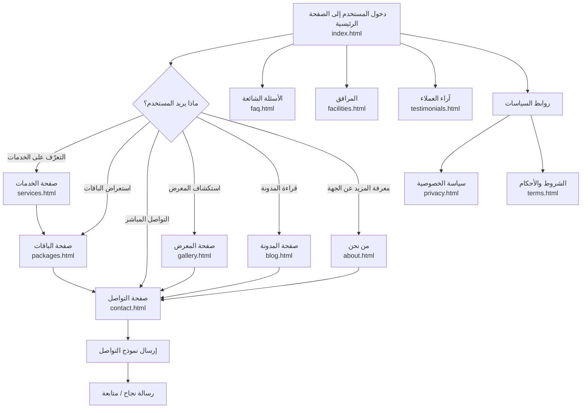
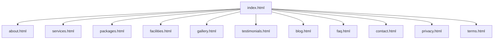

# مخطط الموقع الإلكتروني (Flowchart + Wireframes + Sitemap)

هذا المستند يقدّم تصورًا متكاملًا لبنية الموقع الحالي وتجربة المستخدم:

- **مخطط انسيابي** لمسار المستخدم.
- **تصميمات أولية (Wireframes)** لصفحات أساسية.
- **خريطة موقع (Sitemap)** تعتمد على الصفحات الموجودة فعليًا.

---

## 1) المخطط الانسيابي (User Flow)



---

## 2) التصميمات الأولية (Wireframes)

> ملاحظة: هذه تصميمات هيكلية منخفضة الدقة لتوضيح توزيع العناصر، وليست تصميمًا بصريًا نهائيًا.

### 2.1 الصفحة الرئيسية (Home)

```text
+--------------------------------------------------+
| الشعار | الرئيسية | الخدمات | الباقات | تواصل       |
+--------------------------------------------------+
|                Hero Section                      |
|      عنوان قوي + وصف مختصر + زر CTA             |
|            [احجز الآن]  [اعرف المزيد]           |
+--------------------------------------------------+
|             أقسام سريعة (Cards)                 |
| [خدمات] [باقات] [معرض] [آراء العملاء]           |
+--------------------------------------------------+
|              نبذة قصيرة + إحصائيات              |
+--------------------------------------------------+
|          دعوة للتواصل / نموذج مختصر             |
+--------------------------------------------------+
| Footer: روابط الصفحات + الخصوصية + الشروط      |
+--------------------------------------------------+
```

### 2.2 صفحة الخدمات (Services)

```text
+--------------------------------------------------+
| Header/Nav                                       |
+--------------------------------------------------+
| عنوان الصفحة + مقدمة قصيرة                       |
+--------------------------------------------------+
| [خدمة 1]  [خدمة 2]  [خدمة 3]                     |
| تفاصيل مختصرة + أيقونة + زر "اطلب الخدمة"      |
+--------------------------------------------------+
| قسم أسئلة شائعة متعلق بالخدمات                   |
+--------------------------------------------------+
| CTA نهائي: تواصل معنا                            |
+--------------------------------------------------+
| Footer                                            |
+--------------------------------------------------+
```

### 2.3 صفحة الباقات (Packages)

```text
+--------------------------------------------------+
| Header/Nav                                       |
+--------------------------------------------------+
| عنوان: الباقات والأسعار                           |
+--------------------------------------------------+
| [باقة أساسية] [باقة متقدمة] [باقة مميزة]        |
| السعر - المزايا - زر اختيار                       |
+--------------------------------------------------+
| جدول مقارنة بين الباقات                           |
+--------------------------------------------------+
| CTA: احجز الآن / تواصل للاستفسار                 |
+--------------------------------------------------+
| Footer                                            |
+--------------------------------------------------+
```

### 2.4 صفحة التواصل (Contact)

```text
+--------------------------------------------------+
| Header/Nav                                       |
+--------------------------------------------------+
| عنوان + وسائل التواصل (هاتف / بريد / موقع)       |
+--------------------------------------------------+
| نموذج تواصل                                      |
| الاسم | البريد | الموضوع | الرسالة               |
|                [إرسال]                           |
+--------------------------------------------------+
| خريطة الموقع / موقع الفرع (اختياري)              |
+--------------------------------------------------+
| Footer                                            |
+--------------------------------------------------+
```

---

## 3) خريطة الموقع (Sitemap)



---

## 4) توصيات تصميم سريعة

1. **توحيد CTA أساسي** عبر الصفحات (مثال: "احجز الآن").
2. **إبراز الباقات** بوضوح بصري (بطاقة مميزة للباقة الأكثر طلبًا).
3. **تقليل خطوات التواصل** عبر نموذج بسيط وواضح.
4. **تحسين التنقل** بإضافة روابط سريعة لأهم الصفحات في الهيدر والفوتر.
5. **دعم RTL كامل** في الهوامش والمحاذاة والخطوط لضمان تجربة عربية ممتازة.

